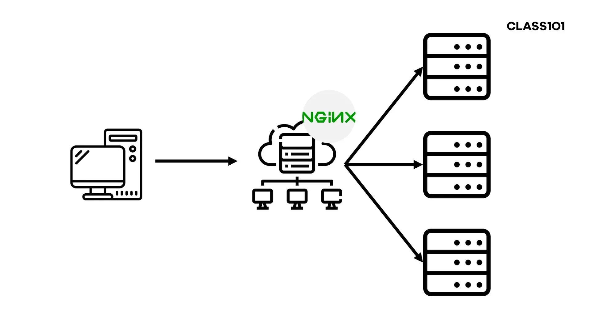

# nginx를 통한 로드밸런싱 구성



nginx로 로드밸런싱 하는 무중단 배포 환경을 만든다.

## 인스턴스 복제

- 머신 이미지 기능으로 복제한다.
    - 서비스마다 스냅샷이라고 부르는 곳도 있다.
- 선택한 인스턴스와 동일한 환경을 가지게 된다.
    - 설치한 패키지만 해당되고 젠킨스, 도커 등의 설정은 해당되지 않는다.

## 복제된 인스턴스 연결


- 젠킨스 설정에서 instance-2, 3을 추가한다.


- instance-2, 3을 추가하고 빌드 스크립트를 똑같이 입력한다.

### 로그 설정

```commandline
nohup docker run -p 8080:80 uesrname/spring-boot-cpu-bound > nohup.out 2>&1 &
```

- `/dev/null`에서 `nohup.out`으로 변경한다.

```text
tail: nohup.out: file truncated
/usr/bin/docker-current: Error response from daemon: driver failed programming external connectivity on endpoint ni
fty_albattani (9caf4a3e7742ebf9682e1847cb1d79868ef12cba0f6727ffe9bcb024380e8797): Bind for 0.0.0.0:8080 failed: por
t is already allocated.
```

- 젠킨스 빌드 후 instance-1로 가보면 배포에 실패한다.
- 기존에 이미 8080 포트에 서비스가 떠있었기 때문이다.

```commandline
[username@cpu-worker-instance-2 ~]$ tail -f nohup.out
/usr/bin/docker-current: Cannot connect to the Docker daemon at unix:///var/run/docker.sock. 
Is the docker daemon running?.
See '/usr/bin/docker-current run --help'.
```

```commandline
sudo systemctl start docker
sudo chmod 666 /var/run/docker.sock
```

- instance-2, 3은 도커 데몬이 실행되지 않고 있어 실패했다.
- 데몬 실행 명령어를 입력해준다.

## nginx 인스턴스 생성

- 인스턴스는 medium으로 생성한다.

### nginx 설치

```commandline
sudo yum install nginx
```

### nginx 실행

```commandline
sudo systemctl start nginx
```

- nginx 인스턴스 외부 ip로 접속만 해도 페이지가 뜨는 게 확인되면 성공이다.

## 로드밸런싱 설정

```commandline
sudo vi /etc/nginx/nginx.conf
```

- nginx 설정 파일로 진입한다.

```text
upstream cpu-bound-app {
  server {instance_1번의_ip}:8080 weight=100 max_fails=3 fail_timeout=3s;
  server {instance_2번의_ip}:8080 weight=100 max_fails=3 fail_timeout=3s;
  server {instance_3번의_ip}:8080 weight=100 max_fails=3 fail_timeout=3s;
}
```

- include와 server 사이에 내용을 추가한다.

```text
location / {
  proxy_pass http://cpu-bound-app;
  proxy_http_version 1.1;
  proxy_set_header Upgrade $http_upgrade;
  proxy_set_header Connection 'upgrade';
  proxy_set_header Host $host;
  proxy_cache_bypass $http_upgrade;
}
```

- server 내부에 추가한다.
- esc
    - shift + ;
        - wq
            - enter

[nginx 로드밸런싱 설정](https://docs.nginx.com/nginx/admin-guide/load-balancer/http-load-balancer/)

### nginx reload

```text
http://{nginx ip}/hash/123
```

- 접속해보면 not found가 뜬다.
- 설정이 완료되면 nginx를 reload 해줘야 하기 때문이다.

```commandline
sudo systemctl reload nginx
```

- 하지만 reload 해도 에러가 발생한다.

```commandline
sudo tail -f /var/log/nginx/error.log
```

- 에러 로그를 살펴본다.

```text
connect() to 10.178.0.6:8080 failed (13: Permission denied) while connect
ing to upstream, client: 124.111.12.53, server: _, request: "GET /hash/123 HTTP/1.1", upstream: "http://10.178.0.6:
8080/hash/123", host: "35.221.162.185"
```

- 구글링 해보면 자원을 액세스 하지 못하는 문제로, rule을 추가해야 한다고 한다.

```commandline
sudo setsebool -P httpd_can_network_connect on
```

- 명령어를 실행하고 다시 페이지에 접속하면 정상적으로 결과가 나타난다.
- nginx에 요청을 보낸 건데도 마치 그 뒤에 있는 CPU 바운드 애플리케이션이 응답한 것 같이 나온다.

## systemctl reload vs restart

- restart
    - 서비스를 shutdown 하고 다시 시작한다.
- reload
    - 설정 파일만 다시 로드한다.
    - 특정 파일은 적용되지 않을 수도 있어 restart가 안전하다.