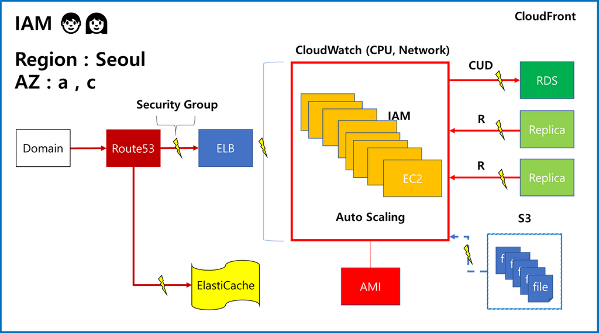
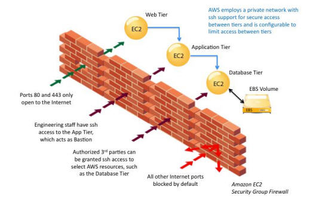
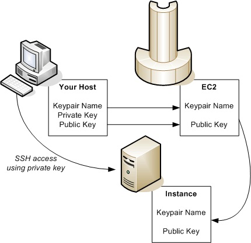
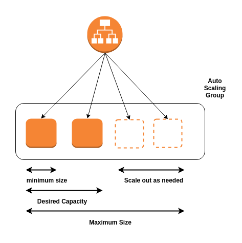
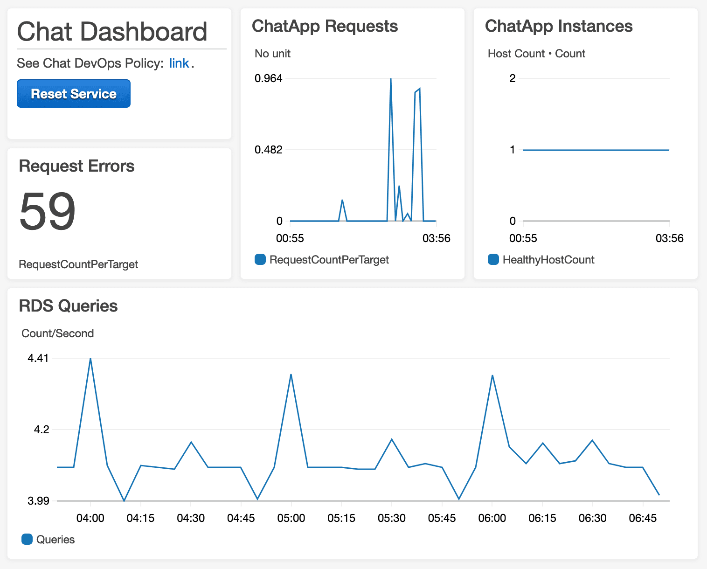
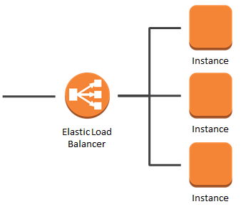
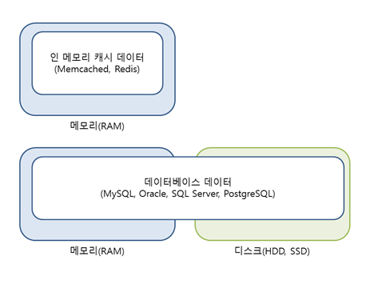
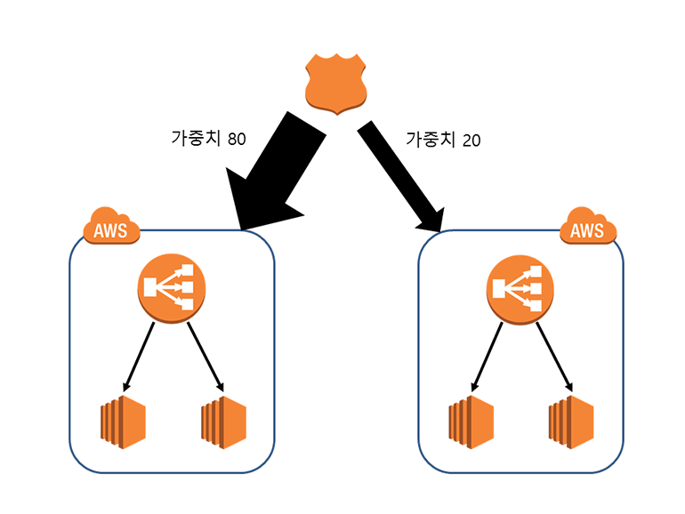

# 아마존 웹서비스와 클라우드 컴퓨팅

AWS는 대표적인 클라우드 서비스다. 클라우드의 핵심은 인터넷이다. 인터넷에 연결되어 있는 거대한 컴퓨터를 사용한다.

## 지역(Region)

- AWS의 모든 서비스가 위치하고 있는 물리적인 장소
- 전 세계 주요 지역에 위치하고 있으며 Region 내부에는 여러 가용 영역이 있음

물리적으로 멀리 떨어져있으면 네트워크의 경유지가 많아진다. 그만큼 경유지에서 병목이 생길 가능성이 크기 때문에 인프라 위치가 가까울 수록 유리하다.

내 서비스를 직접 사용하는 유저가 어디에 있는지도 중요하다. 한국에 유저가 많다면 한국에 있는 인프라를 써야 한다.

각 지역마다 같은 상품을 쓴다고 해도 환율이나 기타 이유로 요금이 다르기도 하다. 따라서 지역을 결정하는 것은 상당히 중요한 이슈다.

## 가용 영역(Availability Zone)

- 데이터 센터의 단위
- 같은 지역 혹은 도시여도 멀리 떨어져 있음

완전히 독립된 region 1, region 2가 있다고 해보자. 각 region에 있는 한 건물이 완파되어도 나머지 건물에 있는 서버는 백업으로 일종의 안전 장치 역할을 하는 것이 가용 구역이다.

각 건물들 사이는 인터넷보다 훨씬 빠른 전용선으로 직접 연결되어 있기 때문에 마치 같은 건물에 있는 것처럼 빠르게 데이터를 주고 받을 수 있다. 따라서 빠르게 백업하고 이전하는 작업을 할 수 있는 것이다.

region 1과 region 2는 직접적으로 연결이 없기 때문에 같은 지역에 있는 서로 다른 가용 영역끼리는 데이터를 주고 받지만 다른 지역끼리는 인터넷으로 느리게 주고 받아야 한다.

### 사용 사례

AWS에서는 EC2 가상 서버를 하나의 Region 안에서도 여러 가용 영역에 만들어 사용할 것을 권장한다. 

ELB를 이용하면 같은 Region에서 여러 가용 영역에 걸친 EC2의 트래픽을 분배할 수 있다. 이렇게 하면 가용 영역 하나에 장애가 발생해도 무중단 서비스를 제공할 수 있다.

## EC2(Elastic Compute Cloud)

독립된 컴퓨터 한 대를 통째로 임대해주는 서비스라고 생각하면 된다. 컴퓨터 한 대를 `인스턴스` 라고 한다.

## 인스턴스
### AMI(Amazon Machine Image)

사용할 운영체제를 고르는 것

### Instance Type

가장 저렴하고 성능이 낮은 t2.nano부터 1년간 무료로 사용할 수 있는 t2.micro, t2.large 등 다양한 타입이 있다. 

- type
    - m: 같은 가격대에서 메모리에 좀 더 우위가 있는 상품
    - c: CPU가 높은 상품
- vCPU
    - v는 virtual을 의미함
- Memory
- Storage
- EBS-Optimaized Available
    - EBS: Elastic Block Store, EC2에 사용하기 위한 고성능 블록 스토리지 서비
- Network Performance
    - 네트워크에서 얼마나 많은 데이터를 전송할 수 있는지를 나타냄

### 온 디맨드 인스턴스

필요할 때만 사용하는 인스턴스

#### 예약 인스턴스

온 디맨드를 쓸 때 좀 더 싸게 이용할 수 있는 것. 예를 들어 1년치를 한꺼번에 사두는 것이다.

#### 스팟 인스턴스

필요할 때마다 켜고 끈다는 것은 그만큼 AWS에서 항상 여유의 컴퓨터를 두고 있다는 것이다. 스팟 인스턴스를 이용하면 노는 컴퓨터가 많을 때 가격이 저렴해지고 그렇지 않으면 가격이 오른다. 주가처럼 가변적인 인스턴스다.

### 태그

해당 인스턴스의 정보를 기록해두고 싶을 때 사용한다. 관리자가 누구인지, 무슨 용도인지 등등을 기록할 수 있다.

### 보안 그룹

인스턴스에 접근할 수 있는 권한을 지정한다. 접속 방식, IP, 포트 등을 구별해서 설정할 수 있다. 파일을 전송하기 위해 접속할 수도, 웹 브라우저로 접속할 수도 있는데 이 모든 접속을 다 허용하면 보안에 문제가 있기 때문이다. 

- Type
    - SSH
    - SMTP
    - HTTP/HTTPS
    - 외 다수 존재

### Key Pair

- EC2 인스턴스에 접속할 때 사용하는 암호화된 파일

비밀번호는 매우 중요하기 때문에 복잡한 체계로 생성해서 파일로 만든다. Key pair name에 비밀번호 파일의 이름을 지정하면 랜덤하게 비밀번호를 지정해서 다운받게 해준다.

## AMI

- EC2 인스턴스를 생성하기 위한 기본 파일

AWS에서는 빈 EC2 인스턴스에 직접 OS를 설치할 수 없다. 따라서 미리 OS가 설치된 AMI를 이용해 EC2 인스턴스를 생성한다.

AMI를 이용하면 만들어 놓은 인스턴스를 특정 시점 상태 그대로 저장할 수 있다. 그 저장한 것을 기반으로 새로운 인스턴스를 만들어낼 수도 있다.

Auto Scaling이나 중요한 작업을 하기 전에 백업해두는 용도로 많이 쓰인다.

## AWS Marketplace

다른 사람이 만들어둔 인스턴스를 가져다 쓸 수 있다.

## Elastic IPs

현재 할당받은 IP는 인스턴스를 Stop 하면 반납된다. 만약 IP를 고정해서 쓰고 싶다면 Elastic IP를 설정한다.

## Scalability

컴퓨터는 물리적인 장치의 결합이다. 그 컴퓨터를 사용하기 위해서는 운영체제가 필요하다. 그 위에서 자기가 컴퓨터인 척 소프트웨어로 동작하는 것이 가상머신이다.

AWS는 대량의 컴퓨터로 가상 머신을 제공하는 서비스다. 우리는 사람이 몰릴 때마다 서버를 증설할 수 없으므로 AWS와 같은 클라우드 서비스를 사용하는 것이다.

이러한 맥락에서 가장 중요한 개념이 `scalability`다. 변화하는 수요에 얼마나 탄력적으로 공급을 변화시킬 수 있는가를 생각하는 것이다.

### Scale Up

인스턴스를 이미지화 시키고 이미지화 시킨 인스턴스를 더 좋은 것으로 실행하면 scale up이 될 것이다. 이때 AMI를 만들면 해당 인스턴스가 잠시 멈추게 되므로 신중해야 한다.

원본 인스턴스가 a이고 새로 만든 인스턴스가 b라면 a의 Elastic IP를 b로 바꿔주면 된다.

### Scale Out

## AutoScaling

- 트래픽이 늘어나면 자동으로 인스턴스를 생성해 서비스를 확장하는 기술

Cloud Watch와 연동해 EC2 인스턴스의 CPU, 네트워크 사용량이 늘어났을 때 새 인스턴스를 생성하고, 줄어들면 삭제한다.

또한, 생성한 EC2 인스턴스를 ELB에 연결하고 ELB는 새로 생성된 EC2 인스턴스에 트래픽을 분산시킨다.

## CloudWatch

- AWS 리소스의 상태를 모니터링 하는 서비스

모니터링 뿐만 아니라 측정치와 연계해 다양한 액션을 취할 수도 있다. EC2 인스턴스의 CPU 사용률, 네트워크 사용량 등을 확인할 수 있으며 이상이 있을 경우 알림을 받거나 자동으로 Auto Scaling을 할 수 있다.

## ELB

HTTP, TCP, SSL 트래픽이 한 곳에 집중될 떄 여러 EC2 인스턴스로 분산시킨다. 서비스가 정상적으로 가동 중인지 확인해 일부 EC2 인스턴스가 중단되어도 트래픽을 정상 EC2 인스턴스로 보내준다.

## Cloud Front

- 전 세계에 파일을 빠른 속도로 배포하는 CDN 서비스이다.

AWS를 사용해도 모든 Region에 EC2 인스턴스나 S3 Bucket을 생성하는 것은 비효율적이고 비용도 많이 든다.

각 사용자들이 에지 로케이션(캐시 서버)에 접속해 빠르게 파일을 다운받도록 해준다.

## ElastiCache

- In Memory Cache를 간편하게 배포, 운영할 수 있도록 도와주는 서비스

읽기 중심의 서비스(소셜 네트워크, 게임, 추천 엔진 등)를 제공해야 하는 환경에 적합하다. DB 부하를 줄이려고 할 때, 대용량 분산 캐시 환경을 자체적으로 운영하는 것이 부담될 때 유용하다.

### In Memory Cache

대부분의 처리를 디스크에서 하는 일반적인 DB와 다르게 메모리에 올려놓고 사용한다. 메모리 캐시에서 정보를 검색하고 분석하면 처리량을 개선해 고성능의 서비스를 제공할 수 있기 때문이다.

## S3

- 인터넷 스토리지 서비스

용량에 관계 없이 파일을 저장하고 웹(HTTP)에서 파일에 접근할 수 있다. 

ASP, JSP와 같은 동적 웹 페이지와 정적 웹 페이지가 섞여 있다면, 동적 웹 페이지만 EC2에서 서비스하고 정적 웹 페이지는 S3를 이용하면 성능을 높이고 비용을 절감할 수 있다.

## RDS

- RDBMS를 손쉽게 생성하고 확장할 수 있는 서비스

DB 사용량이 늘어나면 스토리지 용량과 [IOPS](https://ko.wikipedia.org/wiki/아이옵스)를 증가시켜 성능을 확장해준다. 

장애가 발생하면 Failover 기능으로 정상적인 서비스를 제공하게 해준다. 또한, Read Replica로 읽기 성능을 향상시킨다.

### Read Replica

원본 데이터가 있는 서버를 master, 복제한 서버를 slave라고 한다. DB 작업은 읽기와 쓰기로 구분되는데, 쓰기 작업은 데이터가 변경되므로 한 대의 서버만 작업할 수 있다. 그 서버의 데이터를 복제해서 여러 대의 slave를 만들면 slave는 읽기 작업만 수행한다.

Read Replica는 이러한 일련의 작업을 RDS에서 할 수 있게 만들어준다. DB 인스턴스를 선택하고 Read Replica 멍령을 실행하면 기존 DB 인스턴스가 master가 되고 생성된 인스턴스는 slave가 된다.

## IAM(Identity Access Management)

- 사용자와 그룹을 생성하고 AWS의 각 리소스에 대해 접근 제어와 권한 관리 기능을 제공함

AWS 계정 안에 IAM 그룹과 사용자를 생성해 접근 제어 및 권한 관리를 세분화할 수 있다. 어떤 IAM 사용자는 EC2만 관리할 수 있고, 어떤 IAM 사용자는 S3이 내용만 읽게 구성할 수 있다.

이렇게 사용자별로 필요한 권한만 주면 보안성이 높아진다.

## Route 53

- EC2, ELB, S3, CloudFront와 연동 가능한 DNS 서비스

일반적인 DNS 서비스와 다르게 Latency Based Routing, Weighted Rounded Robin, DNS Failover 등을 제공한다.

53은 DNS 서버 요청이 처리되는 TCP, UDP 53번 포트에서 따왔다고 한다.

### Latency Based Routing

현재 위치에서 지연 시간이 가장 짧은 Region의 IP 주소를 알려준다.

### Weighted Rounded Robin

서버 IP 주소나 도메인(ELB)마다 가중치를 부여해 트래픽을 조절한다.

### DNS Failover

장애가 발생한 서버의 IP 주소 또는 도메인(ELB)를 알려주지 않는다.