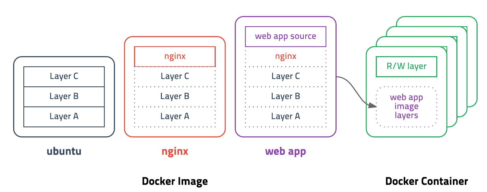

# Docker

- 컨테이너 기반의 오픈소스 가상화 플랫폼

서버를 관리하는 것은 복잡하고 어렵다. OS 설치부터 시작해 서로 다른 라이브러리와 포트 등 다양한 요소를 관리해야 한다. MSA가 유행하면서 프로그램은 더 쪼개지고 설치할 서버가 늘어나면서 이전과는 다른 관리 방식이 등장한다.

## 컨테이너

컨테이너란 다양한 프로그램과 실행 환경을 추상화한 것이다. 추상화하면 동일한 인터페이스를 제공할 수 있으므로 프로그램의 배포와 관리를 단순하게 만들어준다.


컨테이너는 격리된 공간에서 프로세스가 동작하는 것이다. 기존의 가상화는 호스트 OS 위에 게스트 OS 전체를 가상화하는 방식이라 무겁고 느렸다.

이 문제를 해결하기 위해 프로세스를 격리하게 된다. CPU나 메모리는 프로세스가 딱 필요한 만큼만 추가로 사용하므로 성능적으로 손실이 줄어든다. 한 서버에 여러 개의 컨테이너를 실행하면 서로 영향을 미치지 않으므로 가벼워진다.

## 이미지

- 컨테이너 실행에 필요한 파일과 설정값 등을 포함한 것


이미지는 상태값이 없고 변하지 않는 Immutable한 특징이 있다. 컨테이너는 이미지를 실행한 상태라고 볼 수 있다.

같은 이미지에서 여러 컨테이너를 생성할 수 있고 컨테이너가 바뀌거나 삭제되어도 이미지는 그대로 남는다. 추가나 변경된 값은 컨테이너에 저장된다.

 이미지는 컨테이너 실행을 위한 모-든 정보를 갖고 있기 때문에 의존성 파일을 컴파일 하거나 이것저것 설치할 필요가 없다. 서버를 추가하면 미리 만든 이미지를 다운받아 컨테이너를 생성하기만 하면 된다.
 
 ## 레이어 저장방식
 
 이미지는 모든 정보를 가지고 있으므로 용량이 매우 크다. 따라서 매번 다운 받는다면 비효율적일 것이다.
 
 도커는 레이어라는 개념으로 여러 개의 레이어를 하나의 파일 시스템으로 사용하게 해준다.
 
 

이미지는 여러 개의 읽기 전용 레이어로 구성된다. 따라서 파일이 추가되거나 수정되면 새로운 레이어가 생성된다.

필요한 레이어만 다운받으면 되므로 굉장히 효율적으로 이미지를 관리할 수 있다.

## 이미지 경로

 

이미지 관리는 url 방식으로 한다. 이해하기 쉬워 편리하게 사용할 수 있으며 태그 기능을 잘 이용하면 테스트나 롤백도 쉽게 할 수 있다.

## Docker file

```dockerfile
# vertx/vertx3 debian version
FROM subicura/vertx3:3.3.1
MAINTAINER chungsub.kim@purpleworks.co.kr

ADD build/distributions/app-3.3.1.tar /
ADD config.template.json /app-3.3.1/bin/config.json
ADD docker/script/start.sh /usr/local/bin/
RUN ln -s /usr/local/bin/start.sh /start.sh

EXPOSE 8080
EXPOSE 7000

CMD ["start.sh"]
```

Dockerfile을 만들면 서버에 프로그램을 설치하기 위해 의존성 패키지를 설치하고 설정 파일을 만들지 않아도 된다. 소스와 함께 버전이 관리되고 누구나 조회하고 수정할 수 있다.

## Docker Hub

도커는 Docker Hub를 통해 무료로 저장하고 관리할 수 있다.

## 사용 사례
### 서비스 확장

수요를 맞추기 위해 얼마나 많은 앱 인스턴스를 실행할지 모를 때가 있다. 이때 컨테이너로 만들어진 앱과 서비스는 컨테이너 인스턴스 몇 개를 더 배치하는 것으로 수요에 맞게 확장하고 축소할 수 있다.

### 시스템 격리

서로 다른 버전의 API를 위해 여러 버전의 앱을 나란히 구동해야 하거나, 기반 시스템을 깨끗하게 유지하기 위해 새로 배치한 앱이 아무 영향을 미치지 않도록 해야할 때 사용한다.

### 서비스 이식

하나의 앱을 여러 환경에서 구동하고 각 구성을 복제해야 할 때가 있다. 컨테이너는 애플리케이션 전체 런타임 환경을 패키징하므로 도커와 호환되는 호스트만 있다면 어디에나 배치할 수 있다.

개발자 PC부터 테스트 시스템, 로컬 장비, 원격 클라우드 등 다양한 곳에 활용할 수 있다.