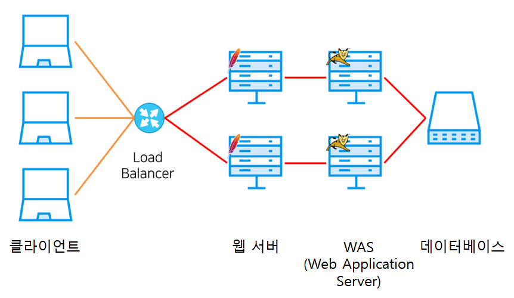

# DBMS 설계

[아직 수정중인 문서]

사용자의 요청과 저장 용량이 많은 서비스는 하나의 저장소만 쓰지 않는다. MySQL, CUBRID, Redis, Memchaced, HBase, MongoDB, Elasticsearch, Arcus, Cassandra 등 다양한 저장소를 활용한다.

[Storm과 Elasticsearch Percolator를 이용한 NELO2 알람 기능 개선](https://d2.naver.com/helloworld/1044388)

[LINE 소셜 네트워크 서비스의 아키텍처](https://d2.naver.com/helloworld/809802)

[LINE 스토리지, 한달에 수십억 건의 데이터를 Redis와 HBase에 저장하다.](https://charsyam.wordpress.com/2012/04/29/발-번역-line-스토리지-한달에-수십억-건의-데이터를-redis와/)

## DB 쿼리 스타일

다양한 저장소가 나와있지만 RDB는 여전히 가장 우선시 되는 저장소다. 항상 쿼리 호출 횟수나 실행 계획이 비효율적이지 않은지 확인하는 습관이 필요하다. ORM 같은 추상화된 프레임워크를 통해 직접 SQL을 작성하지 않더라도 데이터베이스 성능을 개선하는 일은 매우 중요하다.

- 과거
    - 많은 테이블을 한 번에 조인하는 긴 SQL을 사용해 호출 비용을 줄임
    
- 현재
    - SQL이 단순할 수록 저장소에 캐시하거나 분산하기 쉬워져 복잡한 JOIN을 피함
    - 대용량을 저장하는 UGC 서비스는 테이블 사이의 JOIN은 최대한 지양하고 애플리케이션 레벨에서 여러 저장소의 연관된 데이터를 조합함

UGC: User Generated Content, 사용자 생성 콘텐츠

## Stored Procedure

- 장점
    - 네트워크 호출 비용이 없어 성능에 이득이 있음
    - DB 안에 저장되기 때문에 배포 절차가 단순함

- 단점
    - 길게 작성하면 수정하기 어려움
    - 데이터와 독립적으로 로직을 테스트하기 어려움
    - 배포 절차가 없기 때문에 버전 관리가 제대로 되지 않음
    - 데이터를 연산하면서 DB 서버의 CPU를 소모하므로 서비스가 커지면 DB에 병목이 발생할 수 있음

따라서 최근에는 Stored Procedure로 개발했던 로직을 애플리케이션 단으로 빼는 작업이 많이 일어나고 있다.

## 데이터 분산

DB 서버 1대로 트래픽이나 저장량을 감당하기 힘들면 분산해야 한다.

### 로드 밸런서

로드 밸런서로 구성한 일반적인 3계층(3-Tier) 분산 처리 모델이다. 클라이언트의 트래픽이 로드 밸런서를 통해 웹 서버로 분산된다. WAS는 같은 DB를 참조한다.

1. 로드 밸런서에 문제가 생겼을 경우
    - 로드 밸런서를 다중화 해서 DNS 라운드 로빈 방식을 적용해 문제를 처리한다.
    
2. WAS에 문제가 생겼을 경우
    - 다중화로 문제를 풀기가 어렵다.
        - 웹 서버가 다른 WAS를 찾도록 해야 한다.
        - 사용자가 로그인한 상태라면 WAS에 세션 클러스터링을 설정해야 한다.
        - 세션 클러스터링 설정을 위한 추가 작업이 필요하다.
        - 그만큼 관리 지점도 증가한다.
        
3. 데이터베이스에 문제가 생겼을 경우
    - 다중화로 문제를 풀기가 어렵다.
        - 데이터 동기화 문제로 데이터 스토리지 레이어는 다중화가 어렵다.
        - RDB라면 다중화를 어떻게 하고 데이터를 어떻게 분산할 것인지 깊게 고민해야 한다. 예로 샤딩을 도입한다면 샤드를 추가할 때 기존 데이터의 마이그레이션은 어떻게 할지 고민해야 한다.
        - NoSQL이라면 데이터 정합성, 동기화, 장애 복구 시 다수결에 의한 데이터 오염 가능성을 고려해야 한다.
        

[네이버 메인 페이지의 트래픽 처리](https://d2.naver.com/helloworld/6070967)

### Cache 적용

성능 향상을 위해 Local cache, Global cache를 이용한다.

### Master/Slave

복제 지연에 민감하지 않은 서비스에 활용하는 방법이다.

쓰기 작업은 Master 노드로, 읽기 작업은 Master의 데이터를 복제한 여러 대의 Slave로 DB를 구성하는 것이다.

### 샤딩

총 저장되는 용량이 많을 때에는 여러 개의 DB 인스턴스에 나눠서 저장한다. 샤딩의 기준이 되는 키가 명확하면 나눠서 저장하기가 쉽다. 개인화 서비스의 경우 사용자의 ID 별로 샤드 키를 잡으면 된다.

하지만 샤드 키를 무엇으로 잡아야 할지 명확하지 않을 수도 있다. 중간에 샤드키를 바꾸는 비용은 굉장히 크다. RDB는 사용량이 늘어났을 때 분산하는 비용이 비싸기 때문에 성장할 가능성이 있는 서비스라면 RDB 자원을 아껴 쓸 필요가 있다.

- Spider

- MySQL fabric

[NHN의 안과 밖: Sharding Platform](https://d2.naver.com/helloworld/14822)

## Cache 적용
### Global/Local cache 적용범위, 라이프 싸이클, 솔루션 선택

## 파일 저장 정책/솔루션 선택 활용