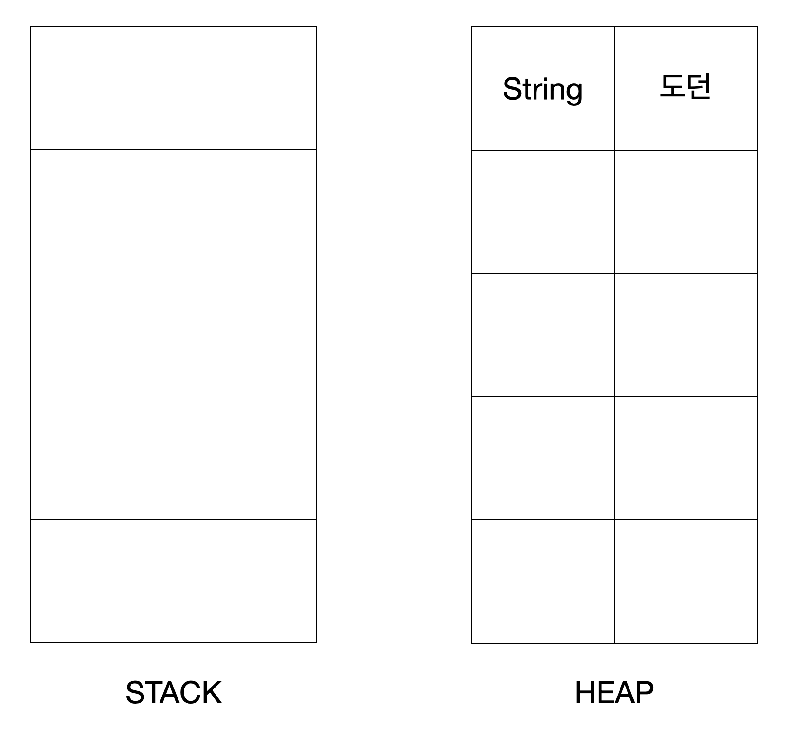
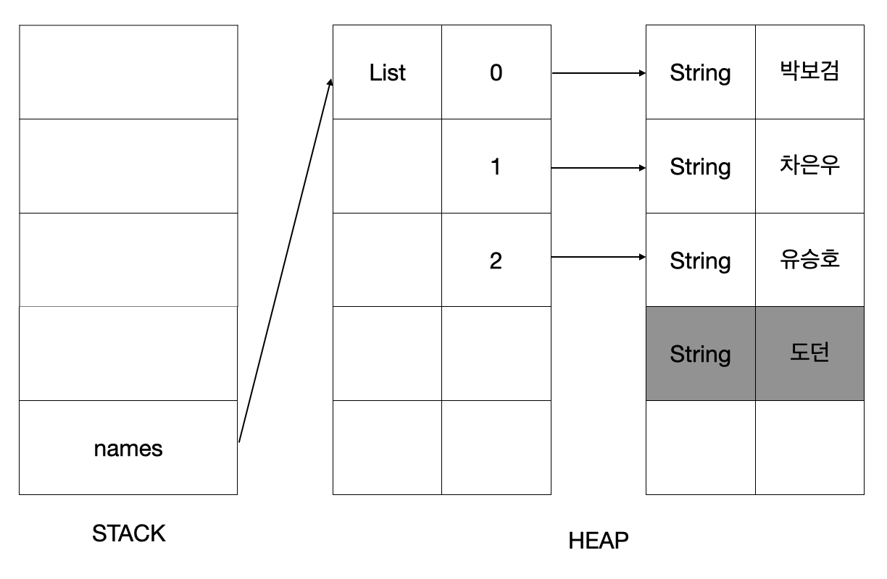
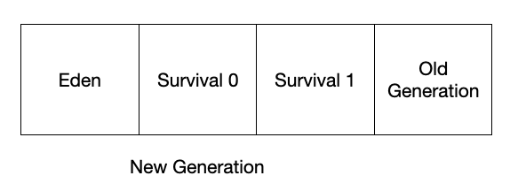
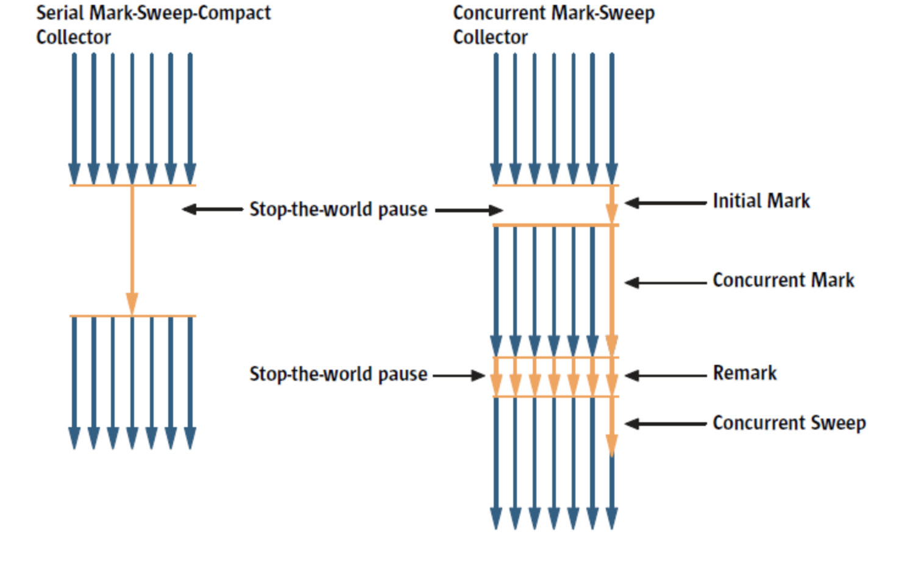

# Garbage Collector

동적으로 할당한 메모리 영역 중 사용하지 않는 영역을 탐지하여 해제하는 기능

여기서 동적으로 할당했다는 의미는 자바의 Heap을 말한다.

- Stack
    - 정적으로 할당한 메모리 영역
    - 원시 타입(primitive type)의 데이터가 값과 함께 할당된다.
    - Heap 영역에 생성된 Object 타입 데이터의 참조 변수를 할당한다.

- Heap
    - 동적으로 할당한 메모리 영역
    - 모든 Object 타입(Object 클래스를 상속받는 모든 데이터)의 데이터가 할당된다.
    - Heap 영역의 Object를 가리키는 참조 변수가 Stack에 할당된다.
    

```java
class Main {
  public static void main(String[] args) {
    int num1 = 10;
    int num2 = 5;
    int sum = num1 + num2;
    String name = "도던";

    System.out.println(sum);
    System.out.println(name);
  }
}
```


1. 코드가 위부터 순차적으로 실행된다.
2. num1, num2, sum이 stack에 쌓인다.
3. String은 객체이므로 Heap에 쌓이고 이 객체를 참조하는 변수가 stack에 쌓인다.



4. main 메서드가 끝나면 stack에 있던 데이터가 pop된다.

이렇게 Heap 영역에 객체 타입의 데이터만 남게 되는데 이 객체를 Unreachable Object라고 한다. 이 객체가 Garbage Collector의 대상이 된다.

## Garbage Collector 처리 과정

1. Mark 단계
  - Garbage Collector가 Stack의 모든 변수를 스캔하면서 각각 어떤 객체를 Heap에서 참조하고 있는지 마킹한다.
  - Reachable Object가 참조하고 있는 객체도 찾아서 마킹한다.
2. Sweep 단계 
  - 마킹되지 않은 객체를 Heap에서 제거한다.




Stack의 name 변수가 Heap의 List 객체를 참조하고 있고, 또 List는 각 String 객체를 참조하고 있다. 도던 객체는 아무 참조도 없기 때문에 Unreachable Object로 분류되어 가비지 컬렉터에 의해 해제된다.

## Garbage Collector 처리 시점

### Heap의 구조



Heap은 Eden, Survival 0, Survival 1, Old Generation으로 이루어져있다.


새로운 객체는 Eden 영역에 할당된다.


Eden 영역이 다 사용되면 Eden 영역의 Unreachable 객체를 메모리에서 해제한다. 즉, GC가 발생한다. 앞서 말한 Mark & Sweep 과정이 Eden 내에서 일어나는 것이다. 이렇게 New Generation에서 일어나는 GC를 `Minor GC` 라고 한다.


여기서 살아남은 객체 즉, Eden 영역의 Reachable 객체는 Survival 0으로 이동한다.


Eden이 차면 Survival 0에 옮기고, 또 Eden 차면 Survival 0으로 옮기는 과정을 반복한다.


Survival 0 영역이 다 차면 다시 Mark & Sweep이 일어나고, Survival 0에서 살아남은 객체는 Survival 1으로 이동한다. 이때 Age 값이 하나씩 증가한다.


Eden 영역의 Reachable 객체는 이미 객체가 차있는 영역인 Survival 1로 계속 쌓이게 된다. 다시 말해 Survival 0과 1 둘 중 하나는 비어있는 상태다.


Survival 1이 차면 Mark & Sweep이 일어나고 Reachable 객체는 Survival 0으로 이동한다. 이때 이동한 객체는 Age 값이 증가한다. 이번엔 Eden 영역이 차면 Survival 0에 쌓인다. 이 과정을 계속 반복한다. 


Age가 특정 값이 되면 Old Generation으로 옮겨진다. 이 과정을 `Promotion`이라고 한다.


계속 반복하면 Old Generation이 차는 순간이 발생한다. 이때 발생하는 GC를 `Major` Garbage Collector 라고 한다.

이 모든 과정을 반복하면서 GC가 메모리를 관리한다.

## Garbage Collector의 종류

### Serial GC


- GC를 처리하는 스레드가 1개다.
- CPU 코어가 1개만 있을 때 사용하는 방식이다.
- Mark-Compact Collection 알고리즘을 사용한다.
  - 일반적인 Mark & Sweep 과정에 Compact가 추가된 것이다.
  - Mark & Sweep을 하고 나면 데이터가 여러 곳에 산발되어 있는데, 이걸 모아서 메모리 파편화를 방지한다.

### Parallel GC

- GC를 처리하는 스레드가 여러 개다.
- Serial GC보다 빠르게 객체를 처리할 수 있다.
- 메모리가 충분하고 코어 개수가 많을 때 사용하면 좋다.

### Concurrent Mark Sweep GC (CMS GC)



그림에서 파란색 화살표는 애플리케이션 스레드, 노란색은 GC 스레드를 의미한다.

- Stop-The-World 구간을 줄인 GC다. 
  - 속도가 중요한 애플리케이션에 사용한다.
- 다른 GC 방식보다 메모리와 CPU를 더 많이 사용한다.
  - 그림을 보면 왼쪽에 비해 전체 과정이 길다.
- Compaction 단계가 제공되지 않는다.

- Initial Mark
  - GC가 Stack의 모든 변수를 스캔하면서 각각 어떤 객체를 Heap에서 참조하는지 찾아 마킹한다.
- Concurrent Mark
  - Initial Mark에서 마킹해뒀던 객체가 어떤 객체를 참조하고 있는지 객체 그래프를 타고 가면서 계속 마킹하는 과정이다.
  - 애플리케이션 스레드와 동시에 일어난다.
- Remark
  - Concurrent Mark는 애플리케이션 스레드와 동시에 일어났기 때문에, 그 사이에 생긴 변화를 다시 한번 검토해서 마킹한다.
- Concurrent Sweep
  - 애플리케이션 스레드와 동시에 수행되면서 데이터들을 해제한다.

- Stop-The-World
  - GC를 실행하기 위해 JVM이 애플리케이션 실행을 멈추는 것을 의미한다.
  - 발생하면 GC를 실행하는 스레드를 제외한 나머지 스레드는 모두 작업을 멈춘다.
    - Stop-The-World 구간에서 GC를 제외한 모든 스레드가 멈춰있다.
  - GC를 완료한 후에 중단한 작업을 다시 시작한다.
  
### G1 GC


- 각 영역을 Region으로 나눠서 바둑판 각 영역에 객체를 할당하다가 GC를 실행한다.
- 해당 영역이 꽉 차면 다른 빈 영역에 객체를 할당하고 GC를 실행한다.
- 쪼개놨기 때문에 GC가 일어날 때 전체 영역(Eden, Survival, Old Generation)을 탐색하지 않는다.
- Stop-The-World 시간이 짧다.
- Compaction을 사용한다.
