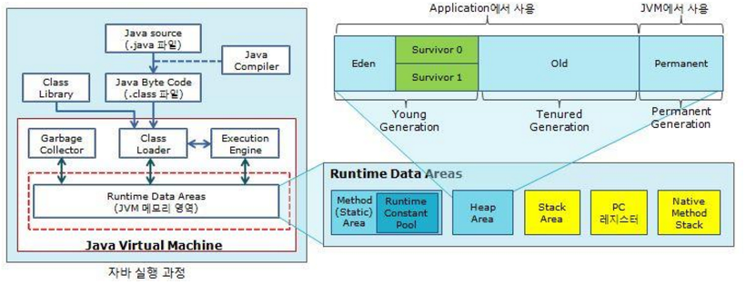

# JVM

JVM은 자바를 실행하기 위한 가상 머신이다. 클래스 로더를 통해 자바 애플리케이션을 읽고 자바 API와 함께 실행한다. 

자바와 OS 사이의 중개자 역할을 해서 OS가 무엇이든 독립적으로 실행할 수 있다.

## 실행 순서

1. 프로그램을 실행하면 JVM이 OS로부터 프로그램이 필요한 만큼 메모리를 할당 받는다.
2. 자바 컴파일러가 `.java` 소스 코드를 읽어서 `.class` 바이트 코드로 변환한다.
3. 클래스 로더로 `.class` 파일을 JVM에 로딩한다.
4. 로딩된 `.class` 파일을 execution engine으로 해석한다.
5. 해석한 바이트 코드를 runtime data areas에 배치하고 실제 수행한다.
6. 그 과정에서 필요할 때마다 GC 작업을 행한다.

## JVM 메모리 영역(Runtime Data Areas)

Java 애플리케이션을 싱행하면서 할당받은 메모리 영역이다.

### Method(Static) Area

클래스와 인터페이스에 대한 `runtime constant pool`, `멤버 변수(필드)`, `클래스 변수(static 변수)`, `생성자`, `메서드`를 저장하는 곳

- 클래스 정보를 올릴 때 맨 처음 저장되는 메모리 공간
- 모든 스레드가 공유하며 GC의 관리 대상이다.

#### Runtime Constant Pool

클래스와 인터페이스 `상수`, `메서드`, `필드`에 대한 모든 레퍼런스를 저장하는 곳

- 메서드 영역에 포함되지만 독자적 중요성이 있다.
- 클래스 파일 `constant_pool` 테이블에 해당한다.
- JVM은 이곳을 통해 해당 메소드나 필드의 실제 메모리 주소를 찾아 참조한다.

### Heap Area

`new` 연산자로 생성된 객체, 인스턴스, 배열 등을 저장하는 곳

- 애플리케이션 상에서 데이터를 저장하기 위해 런타임에 동적으로 할당한다.
- 생성된 객체와 배열은 stack이나 다른 객체의 필드에서 참조한다.
- 더 이상 사용되지 않아 참조하는 변수나 필드가 없거나 명시적으로 null을 선언하면 GC가 관리한다.
- 모든 스레드에서 공유한다.

#### Young Generation

자바 객체가 생성되지 마자 저장되는 공간이다. 시간이 지나 우선순위가 낮아지만 old 영역으로 옮겨진다. 여기서 객체가 사라질 때 Minor GC가 발생한다.

#### Old(Tenured) Generation

Young Generation 영역에 저장되었다가 오래되어 넘어온 객체를 저장한다. 이 영역에서 객체가 사라질 때 Major GC(Full GC)가 발생한다.

### Stack Area

매서드 정보, 지역 변수, 매개 변수, 리턴 값  연산 중 발생하는 임시 데이터를 저장하는 곳

- 스레드마다 하나씩 존재하며 스레드가 시작될 떄 할당된다.
- 메서드를 호출할 때 생성되는 스레드 정보는 frame에 저장한다.
- FILO(First In Last Out) 구조
    - 메서드를 호출할 때마다 frame을 push 하고 종료하면 pop 한다.
- `기본(원시) 타입 변수`는 stack 영역에서 직접 값을 갖는다.
- `참조 타입 변수`는 heap area나 method area의 객체 주소를 갖는다.
- 메서드가 끝나면 소멸된다.

### PC Register

연산 결과값을 메모리에 전달하기 전에 저정하는 CPU 내의 저장장치

- 현재 수행 중인 JVM 명령의 주소를 갖는다.
- CPU에서 Instruction으로 프로그램을 실행한다.
- CPU가 Instruction을 수행하는 동안 필요한 정보를 내부의 레지스터에 저장한다.
- 스레드 마다 하나씩 생성된다.

### Native Method Stack Area

컴파일 한 바이트 코드가 아닌, 실제 실행할 수 있는 `기계어`로 작성된 프로그램을 실행하는 곳

- 자바가 아닌 다른 언어로 작성된 네이티브 코드를 위한 stack이다.
- 즉, JNI(Java Native Interface)를 통해 호출되는 C/C++ 코드를 수행한다.
- 네이티브 메서드의 매개변수, 지역변수 등을 바이트 코드로 저장한다.

### None Heap Area
#### Permanent Generation(Java 7 이전)

클래스 로드로 로드되는 클래스, 메소드의 메타 정보를 저장하는 곳

- 리플렉션을 사용해 동적으로 클래스가 로딩되는 경우 사용한다.
- 리플렉션을 자주 사용하는 Spring Framework를 사용할 경우 이 영역을 고려해야 한다.
- 런타임 시 사이즈를 조절할 수 없어 `OutOfMemoryError`가 발생하는 메모리다.
- JVM 실행 시 `PermSize`와 `MaxPermSize`를 옵션으로 사용할 수 있다.

#### Metaspace(Java 8 이후)

`Permanent Generation`이 변경된 곳

- 기능은 비슷하지만 동적으로 사이즈를 바꿀 수 있다.
- JVM 옵션에서 `PermGem` 부분이 사라졌다.
- Metaspace에 대한 `MetaspaceSize`, `MaxMetaspaceSize` 옵션이 있다.