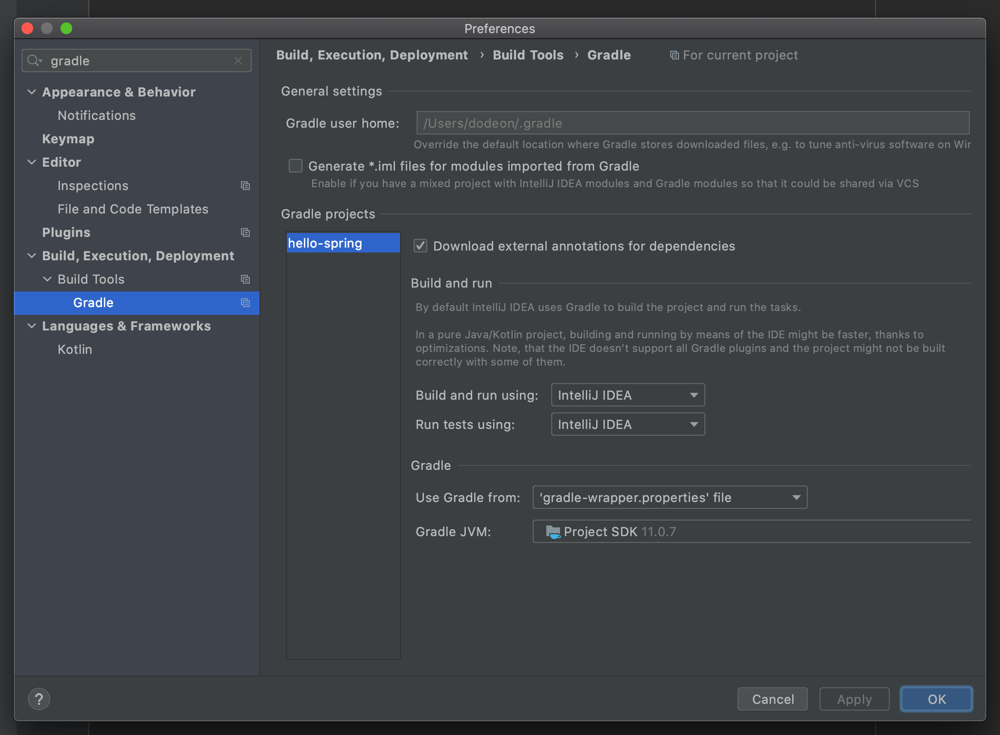

# 프로젝트 환경 설정

## Spring Initializr


### Maven, Gradle

- 필요한 라이브러리를 설치해준다.
- 빌드 라이프 사이클을 관리한다.
- 요즘은 대부분 Gradle을 사용한다.

### Project Metadata

- group: 기업 도메인 명
- artifact: 빌드된 결과물(프로젝트 명)
- name
- description
- package name

### Dependencies

- Spring Web
- Thymeleaf

## build.gradle

```groovy
plugins {
	id 'org.springframework.boot' version '2.3.1.RELEASE'
	id 'io.spring.dependency-management' version '1.0.9.RELEASE' id 'java'
}

group = 'hello'

version = '0.0.1-SNAPSHOT' sourceCompatibility = '11'

repositories {
    mavenCentral()  // 라이브러리를 다운받는 곳
}

dependencies {
	implementation 'org.springframework.boot:spring-boot-starter-thymeleaf' 
	implementation 'org.springframework.boot:spring-boot-starter-web' 
	testImplementation('org.springframework.boot:spring-boot-starter-test') {
		exclude group: 'org.junit.vintage', module: 'junit-vintage-engine' }
}

test {
    useJUnitPlatform()
}
```

### build 설정



- gradle을 통해 빌드하면 느릴 때가 있으므로 intelliJ IDEA로 바꿔준다.

## 스프링부트 라이브러리

`spring-boot-starter-web` 만 다운받았어도 해당 라이브러리가 다른 라이브러리를 필요로 한다면 같이 다운받아준다.

### spring-boot-starter-web

- spring-boot-starter-tomcat: 톰캣(웹서버)
- spring-webmvc: 스프링 웹 MVC

### spring-boot-starter-thymeleaf

- 타입리프 템플릿 엔진(view)

### spring-boot-starter

- 스프링부트 + 스프링코어 + 로킹
- spring-boot
    - spring-core
    
### spring-boot-starter-logging

- logback, slf4j

### spring-boot-starter-test

- junit: 테스트 라이브러리
- mockito: mock 라이브러리
- assertj: 테스트 코드를 좀 더 편하게 작성하도록 도와줌
- spring-test: 스프링 통합 테스트 지원

## View 환경 설정

```html
<!DOCTYPE HTML>
<html>
  <head>
    <title>Hello</title>
<meta http-equiv="Content-Type" content="text/html; charset=UTF-8" /> </head>
<body>
  Hello
  <a href="/hello">hello</a>
</body>
</html>
```

`resources/static/index.html` 을 올려두면 welcome page 기능을 제공한다.

** Reference **

[Spring MVC Welcome Page](https://docs.spring.io/spring-boot/docs/current/reference/html/spring-boot-features.html#boot-features-spring-mvc-welcome-page)


## 템플릿 엔진

```java
@Controller
public class HelloController {

  @GetMapping("hello")
  public String hello(Model model){
    model.addAttribute("data", "hello!");
    return "hello";
  }
}
```

```html
<!DOCTYPE HTML>
<html xmlns:th="http://www.thymeleaf.org">
<head>
  <title>Hello</title>
  <meta http-equiv="Content-Type" content="text/html; charset=UTF-8" />
</head>
<body>
<p th:text="'안녕하세요. ' + ${data}" >안녕하세요. 손님</p>
</body>
</html>
```

** Reference **

[Thymeleaf](https://www.thymeleaf.org/)

[Serving Web Content with Spring MVC](https://spring.io/guides/gs/serving-web-content/)

[Spring MVC Template Engined](https://docs.spring.io/spring-boot/docs/current/reference/html/spring-boot-features.html#boot-features-spring-mvc-template-engines)

### 동작 원리


`/hello` 를 요청하면 스프링부트가 내장하고 있는 톰캣 서버에서 스프링한테 url이 `hello` 로 매핑된 것이 있는지 물어본다. 해당 컨트롤러가 실행되면 `data` 라는 키를 가진 `hello!` 라는 값을 모델에 담는다. 그럼 `hello` 라는 이름을 가진 template을 찾아서 렌더링한다.

즉, controller에서 리턴 값으로 문자를 반환하면 viewResolver가 화면을 찾아서 처리한다. 기본적으로 `resources:templates/` + `{viewName}` + `.html` 을 매핑한다.

`spring-boot-devtools` 라이브러리를 추가하면 `html` 을 컴파일만 해주면 서버 재시작 없이 view 파일 변경이 가능하다. intelliJ에서 `build` - `recompile` 하면 컴파일된다.

## 빌드 및 실행하기

1. `./gradlew build`
2. `cd build/libs`
3. `java -jar hello-spring-0.0.1-SNAPSHOT.jar`