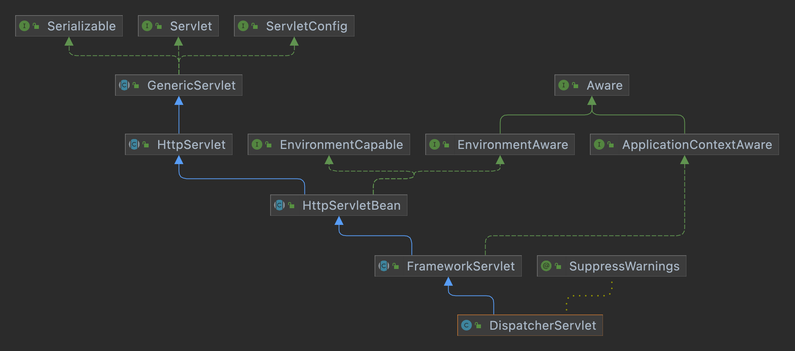

# 스프링 MVC 전체 구조

## 직접 만든 MVC 프레임워크와 SpringMVC 구조


둘은 거의 비슷하게 되어있다.

|     직접 만든 프레임워크      |         스프링 MVC         |
|:--------------------:|:-----------------------:|
|   FrontController    |    DispatcherServlet    |
|  HandlerMappingMap   |     HandlerMapping      |
|   MyhandlerAdapter   |     HandlerAdapter      |
|      ModelView       |      ModelAndView       |
| ViewResolver(method) | ViewResolver(interface) |
|    MyView(method)    |     View(interface)     |

## DispatcherServlet

- `org.springframework.web.servlet.DispatcherServlet`
- 스프링 MVC도 프론트 컨트롤러 패턴으로 되어있다.
- DispatcherServlet은 스프링 MVC의 프론트 컨트롤러이며 스프링 MVC의 핵심이다.



- DispatcherServlet도 결국 HttpServlet을 상속받아 서블릿으로 동작한다.
- 스프링 부트는 DispatcherServlet을 서블릿으로 자동 등록한다.
    - 모든 경로(urlPatterns = "/")에 대해서 매핑한다.
    - 경로가 자세할 수록 우선 순위가 높다.
    - 따라서 기존에 등록한 서블릿도 함께 동작한다.

### 요청 흐름

- 서블릿이 호출되면 HttpServlet이 제공하는 service()가 호출된다.
- 스프링 MVC는 DispatcherServlet의 부모인 FrameworkServlet에서 service()를 오버라이드 했다.
- FrameworkServlet.service()를 시작으로 여러 메서드가 호출되면서 **DispatcherServlet.doDispatch()**가 호출된다.

### doDispatch()

 

```java
public class DispatcherServlet extends FrameworkServlet {
    protected void doDispatch(HttpServletRequest request,
                              HttpServletResponse response) throws Exception {
        HttpServletRequest processedRequest = request;
        HandlerExecutionChain mappedHandler = null;
        ModelAndView mv = null;

        // 1. 핸들러 조회
        mappedHandler = getHandler(processedRequest);
        if (mappedHandler == null) {
            noHandlerFound(processedRequest, response);
            return;
        }

        // 2. 핸들러 어댑터 조회: 핸들러를 처리할 수 있는 어댑터를 찾는다.
        HandlerAdapter ha = getHandlerAdapter(mappedHandler.getHandler());

        // 3. 핸들러 어댑터 실행
        // 4. 핸들러 어댑터를 통해 핸들러 실행
        // 5. ModelAndView 반환
        mv = ha.handle(processedRequest, response, mappedHandler.getHandler());

        processDispatchResult(processedRequest, response, mappedHandler, mv, dispatchException);
    }

    private void processDispatchResult(HttpServletRequest request,
                                       HttpServletResponse response,
                                       HandlerExecutionChain mappedHandler,
                                       ModelAndView mv,
                                       Exception exception) throws Exception {
        // 뷰 렌더링 호출
        render(mv, request, response);
    }

    protected void render(ModelAndView mv,
                          HttpServletRequest request,
                          HttpServletResponse response) throws Exception {
        View view;
        String viewName = mv.getViewName();

        // 6. 뷰 리졸버를 통해서 뷰 조회
        // 7. View 반환
        view = resolveViewName(viewName, mv.getModelInternal(), locale, request);

        // 8. 뷰 렌더링
        view.render(mv.getModelInternal(), request, response);
    }
}
```

 

---

## SpringMVC 구조


1. 핸들러 조회
    - 핸들러 매핑을 통해 요청 URL에 매핑된 핸들러(컨트롤러)를 조회한다.
    - url 뿐만 아니라 content-type 등 여러 데이터를 확인한다.
2. 핸들러 어댑터 조회
    - 핸들러를 실행할 수 있는 핸들러 어댑터를 조회한다.
3. 핸들러 어댑터 실행
    - 핸들러 어댑터를 실행한다.
4. ModelAndView 반환
    - 핸들러 어댑터는 핸들러가 반환하는 정보를 ModelAndView로 변환해서 반환한다.
5. viewResolver 호출
    - viewResolver를 찾고 호출한다.
    - JSP는 InternalResourceViewResolver가 자동으로 등록되어 사용된다.
6. View 반환
    - viewResolver는 view의 논리 이름을 물리 이름으로 바꾸고 렌더링 역할을 담당하는 View 객체를 반환한다.
    - JSP는 InternalResourceView를 반한하며 이 내부에 forward() 로직이 있다.
7. view 렌더링
    - View를 통해 view를 렌더링한다.

## 인터페이스

- 스프링 MVC는 인터페이스를 제공해 DispatcherServlet 코드를 변경하지 않고 기능을 변경, 확장할 수 있게 해준다.
- 이 인터페이스들만 구현해서 DispatcherServlet에 등록하면 자신만의 컨트롤러를 만들 수 있다.

### 주요 인터페이스 목록

- 핸들러 매핑
    - org.springframework.web.servlet.HandlerMapping
    - 우린 단순히 map으로 구현했지만 스프링은 인터페이스로 제공한다.
- 핸들러 어댑터
    - org.springframework.web.servlet.HandlerAdapter
- 뷰 리졸버
    - org.springframework.web.servlet.ViewResolver
    - 우리는 단순하게 메서드로 구현했지만 jsp 용, 타임리프 용 등 다양한 인터페이스를 제공한다.
- 뷰
    - org.springframework.web.servlet.View
    - 이것도 jsp용, 타임리프 용 등 다양하게 제공한다.

## 정리

스프링 MVC는 굉장히 복잡해서 모든 걸 파악하기는 쉽지 않다. 사실 스프링 MVC는 많은 기능을 이미 제공하기 때문에 나만의 컨트롤러를 만들 일이 없다.

그래도 핵심 동작 방식을 알고 있어야 문제가 발생하면 쉽게 파악하고 해결할 수 있다. 확장 포인트가 필요할 때 어떤 부분을 봐야할지 감을 잡기도 쉽다.
