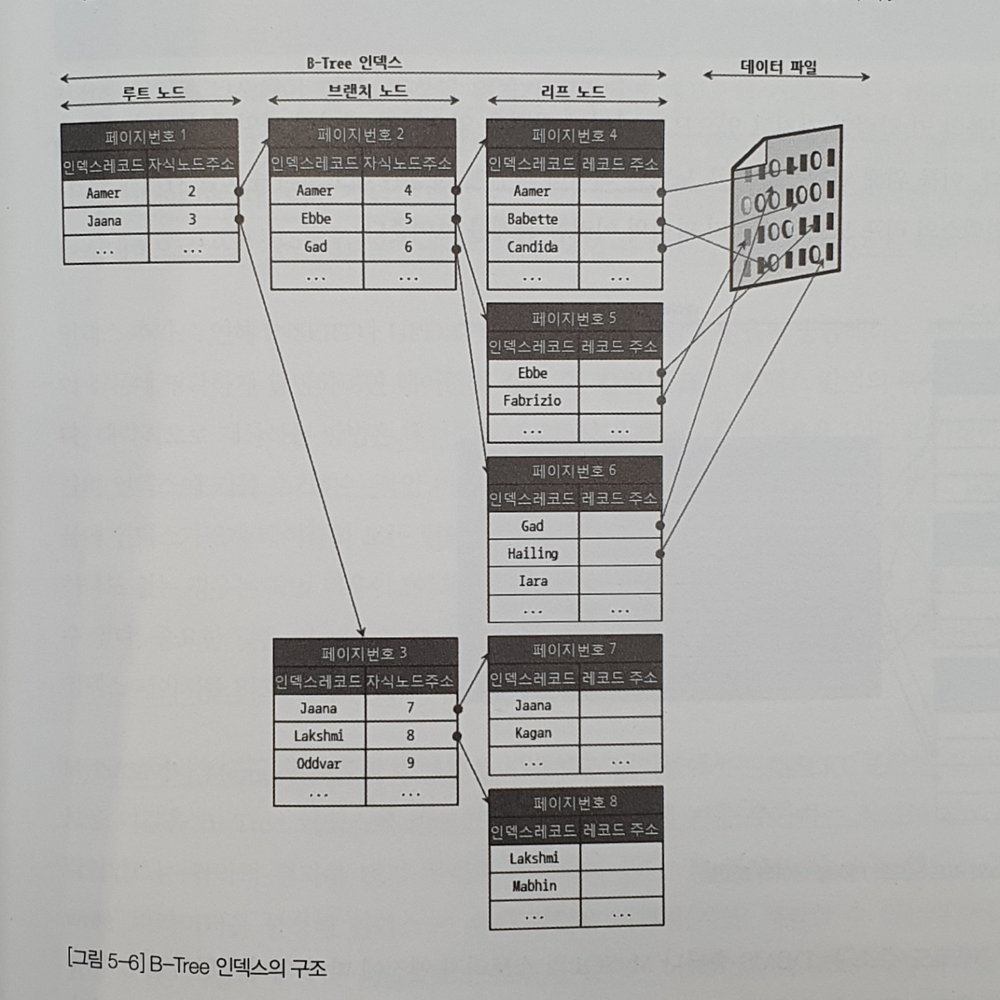

# 인덱스

## 디스크 읽기 방식

데이터베이스 성능 튜닝은 얼마나 디스크 I/O를 줄이느냐가 관건이다. CPU나 메모리같은 주요 장치는 대부분 전자식이지만 디스크 드라이브는 기계식이기 때문에 데이터베이스 서버에서는 디스크 장치가 병목이 된다. 

SSD는 기존 디스크 드라이브에서 플래터(원판)을 제거하고 플래시 메모리를 장착했다. 원판을 기계적으로 회전시킬 필요가 없어 빨리 데이터를 읽고 쓸 수 있다.

디스크 헤더를 움직이지 않고 한 번에 많은 데이터를 읽는 순차 I/O에서는 SSD의 성능이 조금 빠르거나 엇비슷하다. 하지만 랜덤 I/O에서는 훨씬 빠르다. 데이터베이스 서버에서는 랜덤 I/O로 작은 데이터를 읽고 쓰는 작업이 대부분이므로 DBMS용에 최적이다.

### 랜덤 I/O와 순차 I/O

** 공통점 **

원판을 돌려서, 읽어야 할 데이터가 저장된 위치로 디스크 헤더를 이동시키고 다음 데이터를 읽는다.

** 차이점 **

3개의 페이지를 읽는다고 가정해보자.

|랜덤 I/O|순차 I/O|
|------|---|
|시스템 콜 3번|시스템 콜 1번|
|즉, 기록할 위치를 찾기 위해 디스크 헤드를 3번 움직임|1번 움직임|
|순차 I/O보다 느림|랜덤 I/O보다 3배 빠름|

디스크의 성능은 디스크 헤더의 위치 이동 없이 얼마나 많은 데이터를 한 번에 기록하느냐에 의해 결정된다. 따라서 여러번 쓰기, 읽기를 요청하는 랜덤 I/O가 훨씬 부하가 큰 것이다.

일반적으로 쿼리를 튜닝하는 것은 랜덤 I/O를 줄여주는 것이 목적이다. 즉, 쿼리를 처리하는 데 꼭 필요한 데이터만 읽도록 쿼리를 개선하는 것이다.

## 인덱스

책의 마지막에 있는 `찾아보기`가 `인덱스`, 책의 `내용`은 `데이터 파일`에 해당한다. 찾아보기로 알아낼 수 있는 `페이지 번호`는 데이터 파일에 저장된 `레코드의 주소`에 비유할 수 있다. 또한, 찾아보기가 ㄱ, ㄴ, ㄷ 순으로 찾기 쉽게 되어있듯, DBMS도 인덱스를 순서대로 정렬해 최대한 빠르게 찾아갈 수 있게 보관한다.

- 인덱스
    - SortedList
    - 저장되는 값을 항상 정렬된 상태로 유지한다.
    - 저장될 때마다 항상 값을 저장해야 하므로 저장 과정이 복잡하고 느리다.
    - 하지만 이미 정렬되어 있어서 아주 빨리 원하는 값을 가져올 수 있다.
- 데이터 파일
    - ArrayList
    - 저장되는 순서대로 유지한다.

인덱스는 데이터의 저장(INSERT, UPDATE, DELETE) 성능을 희생하고 읽기(SELECT) 속도를 높이는 기능이다. WEHRE 절에 사용되는 칼럼이라고 전부 인덱스로 생성하면 저장 성능이 떨어지고 인덱스 크기가 커져서 역효과가 난다.

### 역할별 구분

- 프라이머리 키
    - 레코드를 대표하는 칼럼의 값으로 만들어진 인덱스
    - 테이블에서 해당 레코드를 식별할 수 있는 기준값
    - 식별자라고도 부른다.
    - NULL과 중복을 허용하지 않는다.

- 보조 인덱스(Secondary key)
    - 프라이머리 키를 제외한 나머지 모든 인덱스
    
- 유니크 인덱스
    - 프라이머리 키와 성격이 비슷해 대체할 수 있기 때문에 대체키라고도 한다.
    - 별로도 분류하기도 하고 보조 인덱스로 분류하기도 한다.
    
### 데이터 저장 방식(알고리즘) 별 구분

- B-Tree
  - 가장 일반적인 인덱스 알고리즘
  - 칼럼 값을 변형하지 않고 원래의 값으로 인덱싱
- Hash
  - 칼럽 값으로 해시 값을 계산해서 인덱싱
  - 매우 빠르게 검색할 수 있다.
  - 값을 변형하기 때문에 prefix처럼 값의 일부만 검색하려면 사용할 수 없다.
  - 메모리 기반 데이터베이스에서 주로 사용한다.
- Fractal Tree
  - B-Tree의 단점을 보완하기 위해 고안되었다.
  - 값을 변형하지 않고 인덱싱한다.
  - 데이터가 저장되거나 삭제될 때 처리 비용을 많이 줄인다.
  
### 데이터 중복 허용 여부 별 구분

- 유니크 인덱스
  - 유니크 인덱스에 동등 조건(Equal, =)으로 검색하면 항상 1건만 찾고 더 이상 찾지 않아도 되므로 쿼리를 실행하는 옵티마이저에게 중요한 문제가 된다.
- Non 유니크 인덱스

## B-Tree(Balanced) 인덱스

- 최상위에 루트노드가 존재하고 그 하위에 브랜치 노드, 가장 하위에 리프 노드가 있다.
  - 리프 노드는 항상 실제 데이터 레코드를 찾기 위한 주소 값을 가지고 있다.
- 인덱스의 키 값은 모두 정렬되어 있지만 데이터 레코드는 임의의 순서로 저장되어 있다.
  - INSERT만 수행하면 순서대로 있겠지만 그 밖에 변경이 일어나면서 삭제된 빈 자리를 채우기 때문이다.
- 하지만 InnoDB는 기본적으로 프라이머리 키 순서대로 정렬되어 클러스터로 저장된다.

인덱스는 테이블의 키 칼럼만 가지고 있다. 나머지 칼럼을 읽으려면 데이터 파일에서 레코드를 찾아야 한다. 그래서 인덱스의 리프 노드는 데이터 파일에 저장된 레코드 주소를 가진다.

InnoDB 테이블에서는 프라이머리 키에 의해 클러스터링 되므로 프라이머리 키 값 자체가 주소 역할을 한다. 따라서 MySQL 테이블의 인덱스는 인덱스 칼럼 값과 주소 값(프라이머리 키값)의 조합으로 구성된다.

