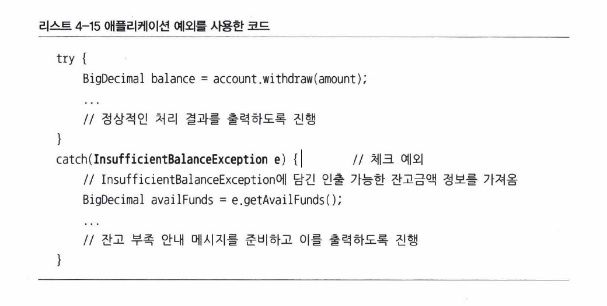

# 예외처리 전략

## 런타임 예외의 보편화

언체크 예외는 시스템 장애나 프로그램의 오류, 체크 예외는 나머지 일반적인 오류라고 했다. 체크 예외는 복구할 가능성이 조금이라도 있다고 생각하기 때문에 `catch`나 `throws`를 강제한다.

워드와 같은 독립형 애플리케이션과 달리 자바 엔터프라이즈 서버 환경에서는 예외를 복구할 수 있는 방법이 없다. 차라리 예외를 미리 파악하고 차단하거나 발생했을 떄 빨리 통보해주는 것이 좋다.

자바 환경이 서버로 이동하면서 체크 예외의 가치는 떨어지고 아무 의미 없는 `throws`만 반복되고 있다. 따라서 대응이 불가능한 체크 예외라면 빨리 런타임 예외로 전환하는 것이 좋다.

## add() 메소드의 예외처리


저번에 나온 add() 메소드는 `SQLException`과 `DuplicateUserIdException` 두 가지의 체크 예외를 던졌다. 

ID 중복이 원인인 경우 발생하는 `DuplicateUserIdException` 은 복구 가능한 예외이지만 나머지 `SQLException`은 대부분 복구 불가능한 예외이므로 차라리 런타임 예외로 포장한다.

그렇다고 굳이 중복 예외를 체크 예외로 둘 필요도 없다. 어디에서든 잡아서 처리할 수 있다면 런타임 예외로 만드는 게 낫다. 단, 어떤 예외인지 명시해서 던져줘야 개발자에게 의미가 있다.



```java
// 별도로 처리하지 않아도 되도록 RuntimeException을 상속한다.
public class DuplicateUserIdException extends RuntimeException {
    // 중첩 예외를 만들 수 있도록 생성자를 추가한다.
    public DuplicateUserIdException(Throwable cause) {
        super(cause);
    }
}

public class UserDao {
    public void add() throws DuplicateUserIdException {
        try {
            // JDBC로 user 정보를 DB에 추가하는 코드
            // 다른 SQLException을 던지는 메소드를 호출하는 코드
        }
        catch(SQLException e) {
            if(e.getErrorCode() == MysqlErrorNumbers.ER_DUP_ENTRY)
                // 예외 전환
                throw new DuplicateUserIdException(e);
            else
                // 예외 포장
                throw new RuntimeException(e);
        }
    }
}
```



```java
public class UserDao {
    public void add(User user) throws DuplicateUserIdExcepton, SQLException {
        try {
            // JDBC로 user 정보를 DB에 추가하는 코드
            // 다른 SQLException을 던지는 메소드를 호출하는 코드
        }
        catch(SQLException e) {
            if(e.getErrorCode() == MysqlErrorNumbers.ER_DUP_ENTRY)
                throw DuplicateUserIdException();
            else
                throw e;
        }
    }
}
```



이제 `add()` 메소드는 불필요한 `SQLException`을 위해 불필요한 throws를 할 필요는 없으면서 필요한 경우엔 `DuplicateUserIdException`으로 중복 상황을 처리할 수 있게 되었다.

이렇게 런타임 예외를 일반화하면 장점이 많지만 컴파일러가 예외처리를 강제하지 않으므로 미리 발생할 수 있는 예외에 대해 알아두는 것이 좋다.

### 낙관적인 예외처리

이처럼 일단 복구할 수 있는 예외는 없다고 가정하고 예외가 생겨도 런타임 예외이니 시스템 레벨에서 알아서 처리하도록 하는 전략을 `낙관적인 예외처리`라고 한다.

필요한 경우는 런타임 예외더라도 잡아서 복구하거나 대응해줄 수 있으니 문제될 것이 없다는 낙관적인 태도에 기반하는 것이다.

### 비관적인 예외처리

반대로 비관적인 예외처리는 직접 처리할 수 없는 예외가 대부분이라고 해도 혹시 놓치는 것이 있을 수 있으니 일단 잡고 보는 것이다. 예외 처리를 강제하는 체크 예외가 해당한다.

## 애플리케이션 예외

시스템이나 외부 상황 때문이 아니라, 애플리케이션 자체의 로직에 의해 의도적으로 발생시키고 조치하도록 하는 예외다.

은행 앱을 개발한다고 해보자. 잔고 부족이 발생하면 0이나 -1 같은 임의의 값을 리턴하는 방법이 있다. 하지만 이러한 리턴값은 표준이 없으므로 의사소통이 잘 안되면 버그 위험이 있다. 메소드가 결과를 돌려주기 위해 if 문을 범벅해야 할 수도 있다.

정상적인 흐름을 따르면서 예외 상황에서만 비즈니스적인 의미를 가진 예외를 던지도록 만들면 if 문을 남발하지 않아도 catch 블록에 깔끔하게 모아 정리할 수 있다.

이때 의도적으로 체크 예외로 만들어야 개발자가 잊지 않고 로직을 구현할 수 있다. 무책임하게 `throws Exception`을 할 수도 있지만 런타임 예외로 만드는 것보다는 상대적으로 안전하다.



코드를 보면 `InsufficientBalanceException`일 때 예외 상황에 대해 상세한 정보를 확인해서 예외 정보에 넣어주고 있다.