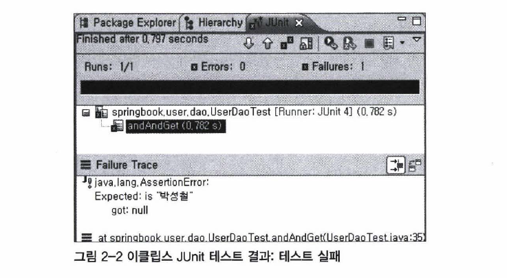

# JUnit 프레임워크

JUnit은 자바 개발자를 위한 단위 테스트 지원 도구이다. 애플리케이션 규모가 커지면 `main()` 메소드로 테스트하는 것에 한계가 있다. JUnit을 사용하면 효율적인 테스트 코드 작성이 가능하다.

1장에서 `프레임워크`의 기본 동작 원리는 제어의 역전이라고 설명했다.

> 프레임워크는 개발자가 만든 클래스에 대한 제어 권한을 넘겨받아 주도적으로 애플리케이션의 흐름을 제어한다.

따라서 `프레임워크`에 있는 코드는 `main()` 메소드도, 오브젝트를 생성하고 실행하는 코드도 필요 없다.

이전에 만든 테스트는 main() 메소드로 만들었다. 즉 제어권을 직접 갖는다는 뜻이다. JUnit 프레임워크에 적용하기 위해서는 `main()`에 있는 코드를 일반 메소드로 옮겨야 한다.

## JUnit으로 전환

JUnit 프레임 워크는 아래의 두 조건을 요구한다.

- 메소드는 `public`으로 선언되어야 한다.
- 메소드에 `@Test` 애노테이션을 붙인다.



```java
import org.junit.runner.JUnitCore;                                  

public class UserDaoTest {
    // JUnit 프레임워크도 자바 코드로 만든 프로그램이므로 어디선가 한 번은 시작시켜줘야 한다. 
    // 여기서는 main() 메소드를 이용한다.
    public static void main(String[] args) {
        // @Test가 붙은 클래스의 이름을 넣어준다.
        JUnitCore.main("user.dao.UserDaoTest");
    }

    @Test
    public void addAndGet() throws SQLException {
        ApplicationContext context = new AnnotationConfigApplicationContext(DaoFactory.class);
        UserDao dao = context.getBean("userDao", UserDao.class);

        User user = new User();
        user.setId("whiteship");
        user.setName("백기선");
        user.setPassword("married");
        
        dao.add(user);
		
		User user2 = dao.get(user.getId());

        // if 문을 스태틱 메소드 asserThat으로 수정한다.
        // 첫번째 파라미터와 두번째 파라미터(매처)를 비교해서 일치하면 넘어가고 아니면 실패한다.
        // is()는 매처의 일종으로 equals()로 비교하는 기능이다.
        assertThat(user2.getName(), is(user.getName()));
        assertThat(user2.getPassword(), is(user.getPassword()));

        // 테스트가 성공하면 다양한 방법으로 알려주기 때문에 굳이 메시지를 출력할 필요가 없다.
    }
}
```



```java
public class UserDaoTest {
	public static void main(String[] args) throws ClassNotFoundException, SQLException {
		ApplicationContext context = new AnnotationConfigApplicationContext(DaoFactory.class);
		UserDao dao = context.getBean("userDao", UserDao.class);
		
		User user = new User();
		user.setId("whiteship");
		user.setName("백기선");
		user.setPassword("married");

		dao.add(user);
			
		System.out.println(user.getId() + " 등록 성공");
		
		User user2 = dao.get(user.getId());

        if (!user.getName().equals(user2.getName())) {
            System.out .println("테스트 실패 (name)");
        }
        else if (!user.getPassword().equals(user2.getPassword())) {
            System . out.println("테스트 실패 (password)") ;
        }
        else {
            System.out.println("조회 테스트 성공");
        }
	}
}
```



`main()` 대신에 일반 메소드로 변경 후 적절한 이름을 붙인다. 여기서는 테스트의 의도를 담을 수 있도록 `addAndGet()`을 사용했다.

### 성공일 경우

```text
JUnit version 4.7
Time: 0.578
OK (1 test)
```

테스트를 실행하는 데 걸린 시간과 결과, 실행한 테스트 메소드 개수를 알려준다.

### 실패일 경우

```text
Time: 1.094
There was 1 failure:
1) addAndGet(dao.UserDaoTest)
java.lang.AssertionError:
Expected: is "백기선"
got: null
...
at dao.UserDaoTest.main(UserDaoTest.java:36)
FAILURES!!
Tests run: 1. Failures: 1
```

JUnit은 `assertThat()`으로 검증했을 때 기대한 결과가 아니면 `AssertionError`를 던진다.


## JUnit 테스트 실행 방법

테스트 없는 스프링은 의미가 없으며 스프링 자체도 JUnit 프레임워크를 이용해 개발되었다. 따라서 반드시 JUnit 테스트 작성 및 실행 방법은 알고 있어야 한다.

`main()` 메소드에서 `JUnitCore`를 이용해 테스트를 실행하고 콘솔 메시지를 확인하는 것은 간단하지만 테스트 수가 많아질 수록 관리가 힘들다. 따라서 자바 IDE에 내장된 JUnit 테스트 지원 도구를 사용하는 것이 좋다.

### IDE

이클립스에서 `@Test`가 들어있는 테스트 클래스를 선택한 뒤, `run` - `Run As` - `JUnit Test` 를 선택하면 테스트가 자동으로 실행된다.




테스트의 총 수행시간, 테스트/에러/실패 개수를 확인할 수 있다.

### 빌드 툴

`ANT`, `메이븐` 같은 빌드 툴과 스크립트로 JUnit 테스트를 실행할 수도 있다. 테스트 실행 결과는 옵션에 따라 HTML이나 텍스트 파일로 만들어진다.

개발자 개인이 사용하기에는 IDE 도구를 활용하는 것이 제일 편리하지만, 여러 개발자가 만든 코드를 통합해서 테스트를 해야할 때는 빌드 스크립트를 이용한다.